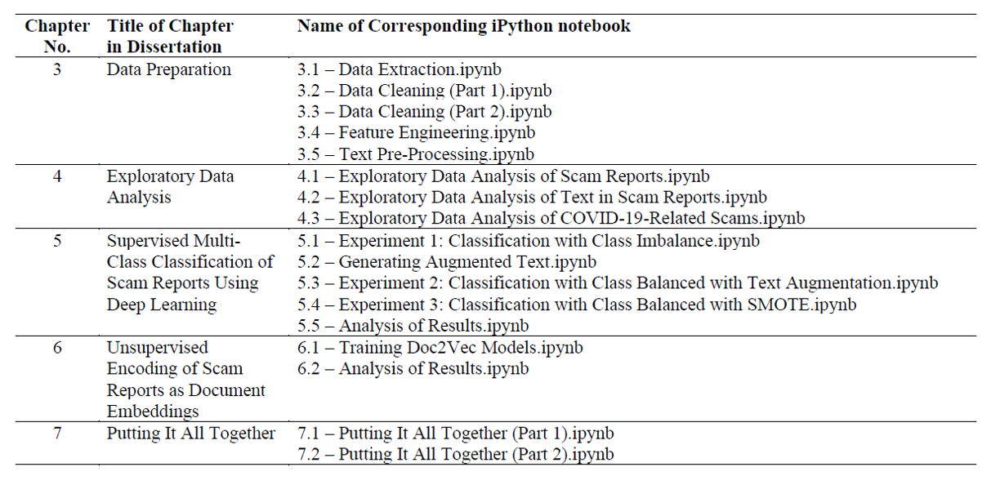

# **Supervised and Unsupervised Applications of Natural Language Processing on Free Text towards Tackling Scams**
## MATH5872M Dissertation in Data Science and Analytics
## University of Leeds, September 2020 
### Author: Zeya Lwin Tun
### Supervisors: Dr Daniel Birks and Dr Leonid Bogachev

This repository contains reproducible code written in Python 3.7.7 as part of my Master's dissertation at University of Leeds. My dissertation is titled **Supervised and Unsupervised Applications of Natural Language Processing on Free Text towards Tackling Scams**. 

### Abstract

Scams are becoming increasingly prevalent and a cause of concern globally. In Singapore, scams made up 27.0\% of overall crimes in 2019, compared to 17.5\% in 2018. In the first half of 2020, a total of S\$82 million was cheated from victims, almost twice the amount in the same period of 2019. Besides immediate financial losses, victims of scams also suffer from longer-term emotional and psychological effects. Despite efforts by authorities, victims continue to fall prey, owing partly to more sophisticated means used by scammers. There is therefore a strong need to increase the understanding of scams and how they can be prevented. 

The research in this dissertation aims to achieve this by drawing lessons from others’ scam experiences shared on `Scam Alert’, a Singapore-based website aimed at promoting scam awareness. More specifically, this research harnesses the hidden potential of free text in these scam reports using machine learning and Natural Language Processing (NLP) methods towards the following research goals: finding scam reports with similar modus operandi, extracting common characteristics from similar scam reports and classifying scam reports.

In pursuit of these research goals, this dissertation presents novel applications of machine learning and NLP on free text in scam reports in two areas: supervised and unsupervised. In supervised application, deep learning techniques are used for multi-class classification of scams. Given class imbalance in the data, text augmentation techniques and the Synthetic Minority Over-sampling Technique are explored. In addition, the efficacy of using pre-trained Global Vectors (GloVe) word embeddings is examined. Results show that the Long Short-Term Memory model trained without GloVe word embeddings on a dataset balanced with text augmentation outperformed the rest. 

In unsupervised application, the concept of vector semantics is leveraged using doc2vec models to encode scam reports as document embeddings. To evaluate doc2vec models, a new framework known as normalised Similarity-Dissimilarity Quotient (SDQ) is introduced. Normalised SDQ assesses a doc2vec model's ability to infer document embeddings that can recognise similar and dissimilar reports from sets of pre-identified scam reports. Using normalised SDQ, the most optimal doc2vec model is found to be the model trained with 150 epochs, 50-dimensional embeddings and the Distributed Memory Model of Paragraph Vector algorithm. 

Findings from both supervised and unsupervised applications lay the foundation for the development of tools towards achieving the research goals. It is envisioned that these tools will sharpen the sense-making capabilities of law enforcement authorities in better understanding how scams operate and in identifying intervention points where scams can be disrupted. With such insights, public education and engagement efforts can be more tailored and effective. They also boost quality of criminal investigations against scammers, which in turn serves as a deterrent and helps toughen the stance against scams. Additionally, these tools can nurture a stronger sense of awareness and guardianship within the society. After all, a discerning public is the strongest defence against scams.

### Table of Contents for iPython Notebooks

The .ipynb notebooks are organised as follow:

### Acknowledgements

National Crime Prevention Council, Singapore. 
